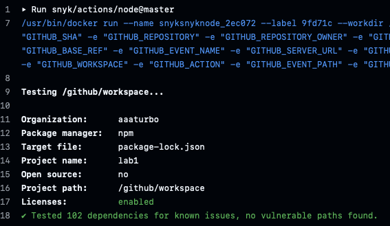

# Работа 1: Разработка защищенного REST API с интеграцией в CI/CD

## Описание проекта и API
Проект предоставляет API для аутентификации пользователей и просмотра зарегистрированных пользователей.
Реализована регистрация и авторизация с использованием JWT токенов,
а также защищенный эндпоинт для получения списка зарегистрированных пользователей.

### Аутентификация

#### Регистрация нового пользователя

- Endpoint: POST /auth/register \
- Тип: Public \
- Тело запроса:
```
{
"username": "string",
"password": "string"
}
```
- Описание: Создает нового пользователя в системе

#### Авторизация пользователя

- Endpoint: POST /auth/login \
- Тип: Public \
- Тело запроса:
```
{
"username": "string",
"password": "string"
}
```
- Ответ:
```
{
"token": "string"
}
```
- Описание: Выполняет вход пользователя и возвращает JWT токен для доступа к защищенным эндпоинтам

### Работа с данными (требуют JWT токен)

#### Получение списка зарегистрированных пользователей

- Endpoint: GET /api/data/users
- Тип: Secured (JWT)
- Заголовки: Authorization: Bearer <token>
- Ответ:
```
{
"list": [{"username1"}, ...]
}
```
- Описание: Возвращает список всех зарегистрированных пользователей.

## Описание реализованных мер защиты

### Защита от SQLi
Для создания SQL-запросов не используется конкатенация строк,
только параметризированные запросы. 

### Защита от XSS
Все пользовательские данные, которые возвращаются в ответах и приходят в запросах,
в формате JSON и сериализуются в объекты. Также я пордключил библиотеку helmet,
она ограничивает источники, из которых можно загружать скрипты, стили и другие ресурсы.
А также оа включает встроенную защиты в XSS браузерах, которая блокирует подозрительные скрипты.

### Защита от Broken Authentication
Я реализовал middleware для проверки токена авторизации, все защищенные
эндпоинты обрабатываются только после этого middleware, который требует
JWT-токен в заголовке запроса. На уровне middleware токен парсится и валидируется.
Доступ предоставляется, только если он валиден. Username пользователя хранится в токене, и не может быть свободно изменен.
Пароли пользователей в БД хранятся в захэшированном с помощью bcrypt-алгоритма виде.

## Отчеты SAST/SCA

### Отчет SAST (Static Application Security Testing)
Для тестирования используется npm audit


### Отчет SCA (Software Composition Analysis)

Для тестирования используется Snyk
